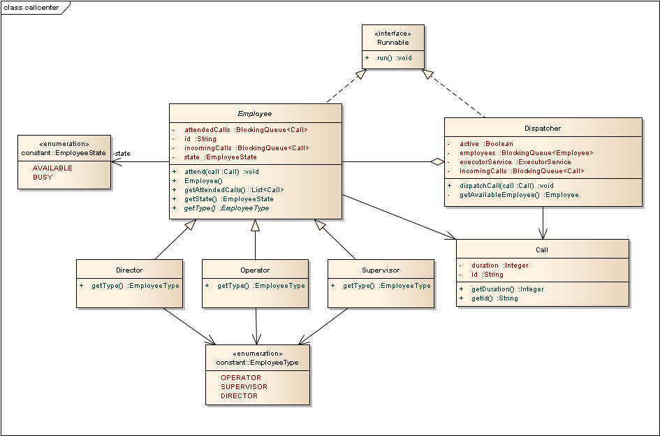

# Call Center

Call Center with three different types of employees:

* Operator
* Supervisor
* Director

In the event of a call, an available operator must attend it. If no operator is available then an available supervisor must attend it. If no supervisor is available then an available Director must attend it. If no employee is available then the call is left hanging, until there is one available.

## Solution

The program works around a thread pool of 10 concurrent employees attending calls.

If at some point there isn't any available employee, the call is left in a queue waiting to be attended.

## Class Diagram



### Prerequisites

In order to run this program you will need to have [Maven](https://maven.apache.org/) installed in your local machine.

### Compiling

In order to compile the program, you need to run the next sentence:

```bash
mvn clean install
```

## Running the tests

By running mvn clean install you'll be already running the tests.

## Built With

* [Maven](https://maven.apache.org/) - Dependency Management
* [JUnit](https://junit.org/junit5/) - Testing Framework
* [Apache Commons](https://commons.apache.org/proper/commons-lang/) - Miscelanea
* [SLF4J](https://www.slf4j.org/) - Logging

## Author

* **Carlos Fernando Ruiz Nieto**
